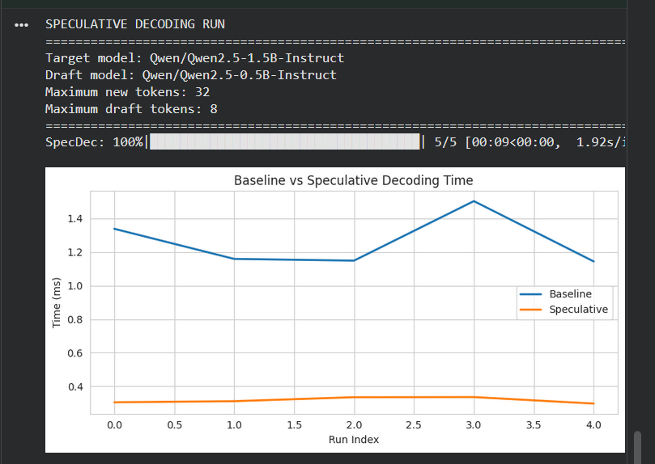

# `specdec` — Speculative Decoding Test Harness

`specdec` is a lightweight library for experimenting with **speculative decoding** in large language models.

## Quick Start

```python
from specdec import run

run(
    target="Qwen/Qwen2.5-1.5B-Instruct",
    draft="Qwen/Qwen2.5-0.5B-Instruct",
    prompts=[
        "Explain speculative decoding in simple terms.",
        "What is the difference between the draft and the target model?"
    ],
    max_new_tokens=64,
    max_draft_tokens=16
)
```

# Project Structure
````
specdec/
  main.py             # Main script to run (Done)
  evaluators.py       # dataset + benchmark runners (Yet to be added)
  metrics.py          # timing, acceptance stats    (Yet to be added)
  utils.py            # timers, helpers (Done)
````

# Some early timing results

